<center>
<h1>Portfolio</h1>

<code class="sql">
SELECT * FROM sections;
</code>

<p align="center">
<a href="https://fabriziocominetti.github.io/#university">🎓 University</a> |
<a href="https://fabriziocominetti.github.io/#data-world">🔎 Data World</a> |
<a href="https://fabriziocominetti.github.io/#football-analytics">⚽ Football</a>
</p>
</center>

---
## **University**
<!-- ```python
print("Explore University Projects")
``` -->

Collection of projects completed for the university courses of the Master's Degree in Data Science at [UniMiB](https://www.unimib.it/) (2021-2024) `|` [GitHub](https://github.com/fabriziocominetti/data-science-UniMiB)

<!--
<details>
  <summary>Table of Contents | University</summary>
  
  - [Master's Thesis](#master-s-thesis)
  - [Social Media Analytics](#social-media-analytics)
  - [Financial Market Analytics](#financial-market-analytics)
  - [Machine Learning](#machine-learning)
  - [Data Management](#data-management)
  - [Text Mining and Search](#text-mining-and-search)
  - [Data Science Lab on Smart Cities](#data-science-lab-on-smart-cities)

</details>
-->

---
### Master's Thesis

[](https://github.com/fabriziocominetti/data-science-UniMiB/blob/main/Master's%20Thesis/Cominetti_Fabrizio-Tesi_LMDS.pdf)
[](https://github.com/fabriziocominetti/data-science-UniMiB/tree/main/Master's%20Thesis)

**Exposing Bias in Vision-Language Models**

<p style="color:#727272">Multimodal models have brought about significant and rapid technological innovations in recent years. Among these, vision and language models excel at processing, comprehending, and manipulating data and information from two modalities: text and image, representing textual and visual components, respectively. However, the possible presence of bias represents a significant concern that can overshadow their impressive capabilities. Starting with the construction of a novel and morphed dataset derived from UTKFace, this paper utilizes three pre-trained models - ALBEF, BLIP-2, and CLIP - to investigate gender and racial biases in VL models. The experiments span from zero-shot retrieval to zero-shot classification tasks, aiming to identify and measure bias across specific demographic groups. The findings contribute to advancing fair artificial intelligence by emphasizing the importance of addressing biases, particularly within these increasingly adopted models.</p>

<center></center>

<center>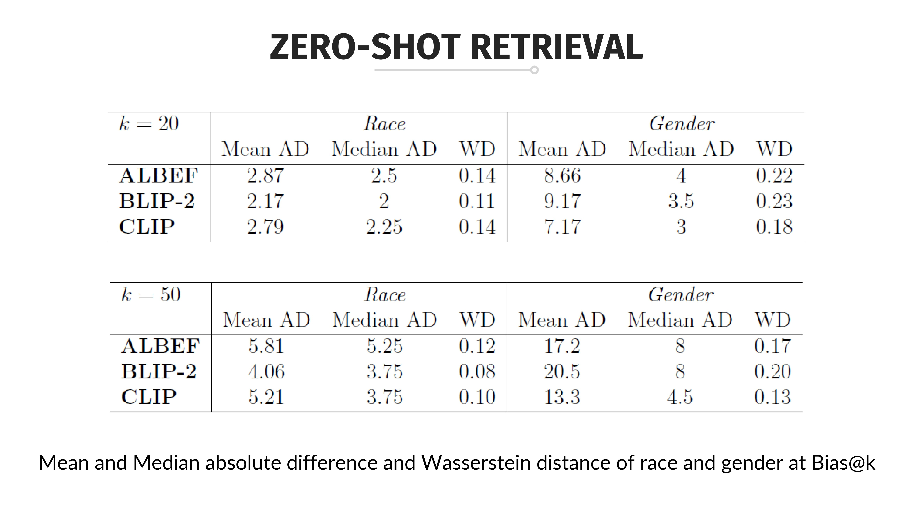</center>

<center></center>

[Slideshow](https://github.com/fabriziocominetti/data-science-UniMiB/blob/main/Master's%20Thesis/Slideshow-Cominetti_Fabrizio_Tesi_LMDS.pdf)

---
### Social Media Analytics

[](https://github.com/fabriziocominetti/data-science-UniMiB/blob/main/Social%20Media%20Analytics/Report_SMA.pdf)
[](https://github.com/fabriziocominetti/data-science-UniMiB/tree/main/Social%20Media%20Analytics)

**Smart Working - Social Network and Content Analysis** `|` [_Social Media Analytics_](https://elearning.unimib.it/course/info.php?id=44573), UniMiB (2023).

<p style="color:#727272">This project focuses on the sentiment and community analysis of Twitter discussions regarding the topic of smart working. Using the Twitter API and the Tweepy library, 2667 tweets containing relevant keywords were collected from Dec 26, 2022, to Jan 5, 2023. After preprocessing, a Social Network analysis (including nodes degree, assortativity, and community detection) and a Social Content analysis (covering sentiment analysis and emotion recognition) were performed. The analysis revealed that even with 1820 nodes, communities easily formed, and 'anger' prevailed in discussions on smart working, indicating significant emotional response.</p>

<center>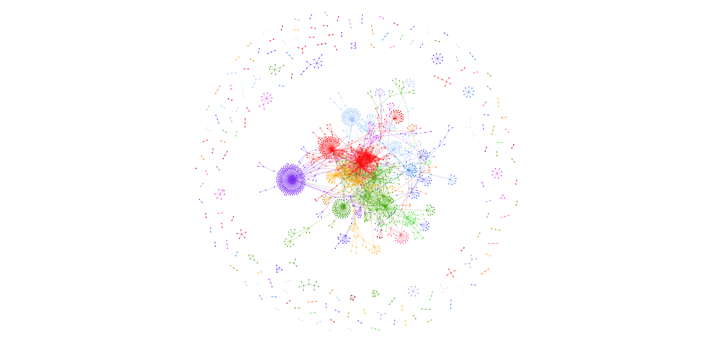</center>

---
### Financial Market Analytics

[](https://github.com/fabriziocominetti/data-science-UniMiB/blob/main/Financial%20Market%20Analytics/Report_FM.pdf)
[](https://github.com/fabriziocominetti/data-science-UniMiB/tree/main/Financial%20Market%20Analytics)

**Portfolio Analysis** `|` [_Financial Market Analytics_](https://elearning.unimib.it/course/info.php?id=37918), UniMiB (2022).

<p style="color:#727272">In this project, the aim is to better understand the structural characteristics that risk brings to real investment portfolios. Using five years of data for the EURO STOXX 50 index and constituent stocks, portfolios based on various risk factors were constructed. The portfolios outperformed the index in returns but exhibited higher volatility, illustrating the subtle risk-return relationship. Comparative analysis reveals the trade-off between returns and volatility, shedding light on portfolio efficiency, and the findings emphasize strategic portfolio construction for optimal risk management and return maximization.</p>

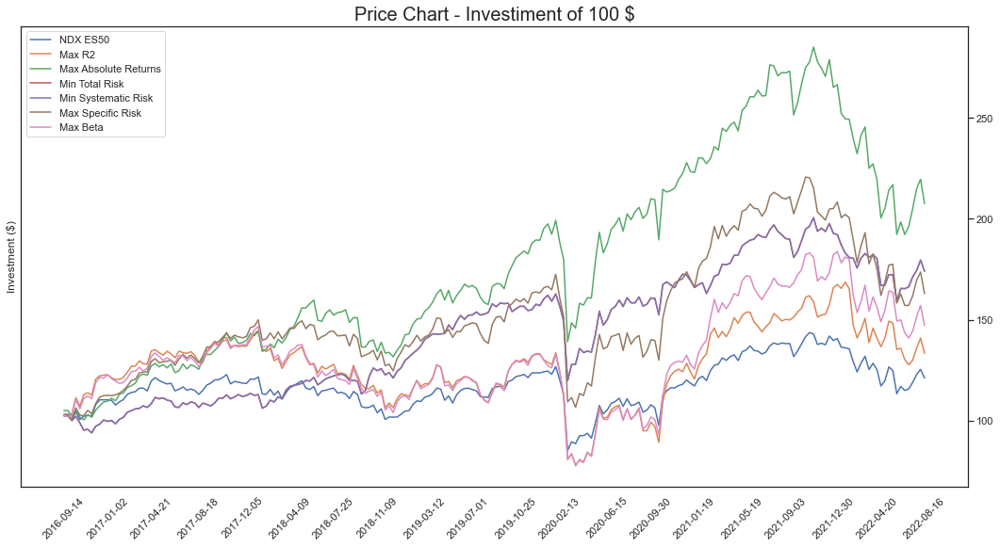

---
### Machine Learning

[](https://github.com/fabriziocominetti/data-science-UniMiB/blob/main/Machine%20Learning/Report_ML.pdf)
[](https://github.com/fabriziocominetti/data-science-UniMiB/tree/main/Machine%20Learning)

**Climate Change - Temperature Prediction** `|` [_Machine Learning and Decision Models_](https://elearning.unimib.it/course/info.php?id=37912), UniMiB (2022).

<p style="color:#727272">This project focuses on the analysis of various regression models applied to a dataset containing global temperature data from January 1750 to November 2015. Utilizing the Knime platform, the research aimed to develop predictive models to forecast the average global temperature for the subsequent month based on the previous month's data. The study explored multiple regression techniques, including Linear Regression, Polynomial Regression, Tree Ensemble, Random Forest, and XgBoost. The evaluation phase revealed that the TE and RF models demonstrated superior performance with higher R² and lower Mean Squared Error (MSE) compared to other models.</p>

<center>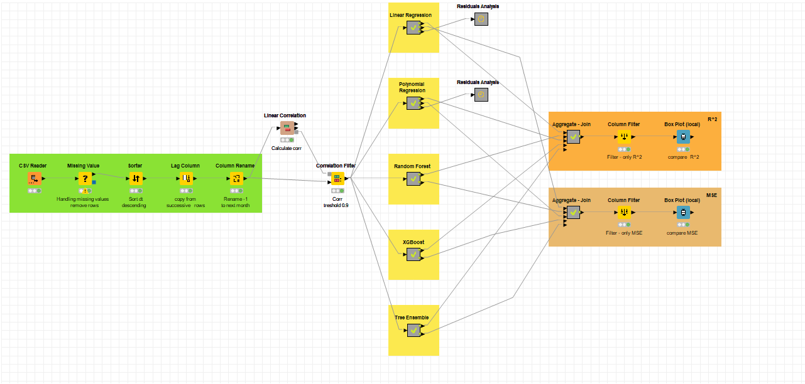</center>

---
### Data Management

[](https://github.com/fabriziocominetti/data-science-UniMiB/blob/main/Data%20Management/Report_DM.pdf)
[](https://github.com/fabriziocominetti/data-science-UniMiB/tree/main/Data%20Management)

**Marvel Graph Database** `|` [_Data Management_](https://elearning.unimib.it/course/info.php?id=37922), UniMiB (2022).

<p style="color:#727272">The project aimed to create a comprehensive database for the Marvel Universe, incorporating relationships between characters, comics, movies, and TV series. Data were collected from both API and web scraping sources and integrated into Neo4j, a non-relational graph database. The resulting database comprised over 60K nodes and 117K relationships, enabling efficient querying and visualization. This database serves as a valuable resource for recommendation systems and interactive platforms, forming a kind of 'social network' of Marvel characters connected to their respective comics, movies, TV series, and interpersonal relationships.</p>

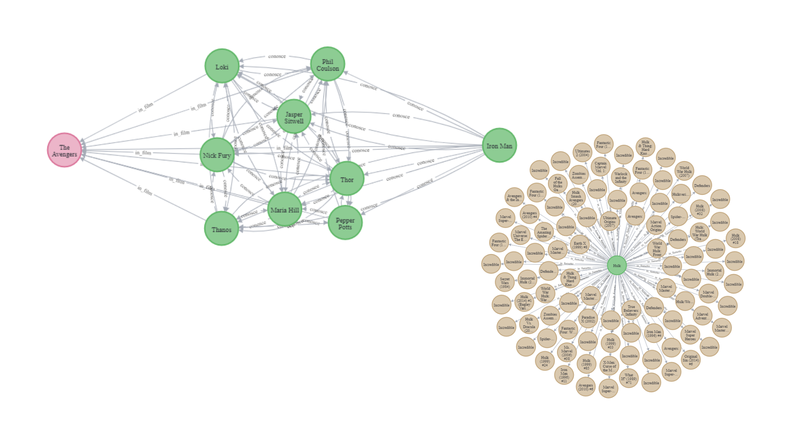

---
### Data Visualization

[](./projects/data-visualization-UniMiB/data-visualization-UniMiB.html)
[](https://github.com/fabriziocominetti/data-science-UniMiB/blob/main/Data%20Visualization/Report_DV.pdf)
[](https://github.com/fabriziocominetti/data-science-UniMiB/tree/main/Data%20Visualization)

**Film - Rating and Duration Time** `|` [_Data Visualization_](https://elearning.unimib.it/course/info.php?id=26218#en), UniMiB (2022).

<p style="color:#727272">In today's attention-driven economy and society, is it true that people prefer shorter films? This consideration inspired the realization of this project and led to the formulation of the following research question: do shorter films generally receive better ratings? To address this question, we have exploited datasets sourced from IMDb and developed an interactive visualization in Python.</p>

<center>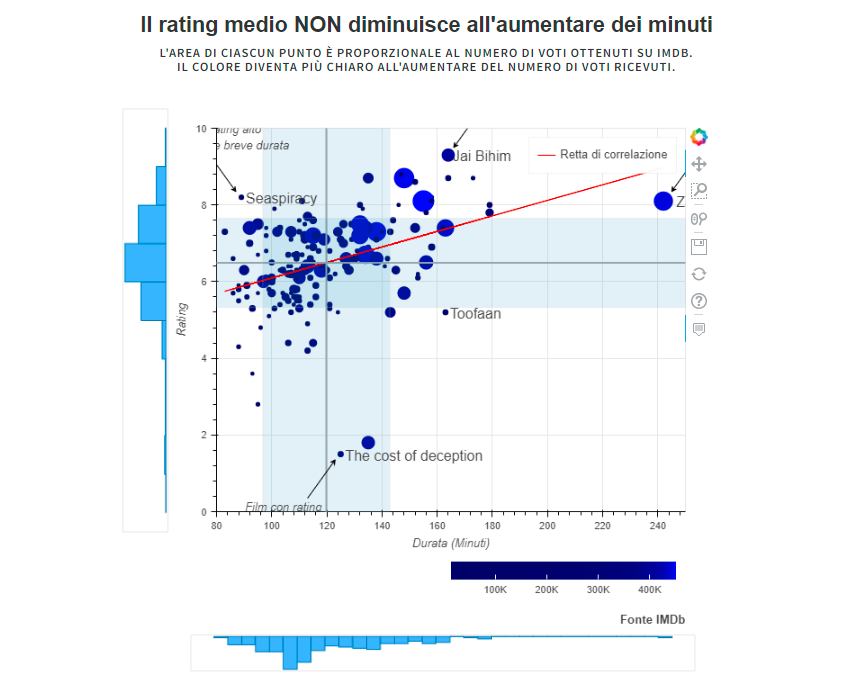</center>

---
### Text Mining and Search

[](https://github.com/fabriziocominetti/data-science-UniMiB/blob/main/Text%20Mining%20and%20Search/Report_TMS.pdf)
[](https://github.com/fabriziocominetti/data-science-UniMiB/tree/main/Text%20Mining%20and%20Search)

**IMDb Reviews - Text Classification and Clustering** `|` [_Text Mining and Search_](https://elearning.unimib.it/course/info.php?id=44576), UniMiB (2023).

<p style="color:#727272">In this project, 50K user-released reviews from the IMDb platform were analyzed and the primary goal was binary sentiment classification and identifying text clusters. Various text processing techniques were utilized, including the removal of numbers, stopwords, punctuation, tokenization, lowercase conversion, and lemmatization. After preprocessing, the text was represented using Bag of Words and Tf-Idf methods, with n-grams ranging from unigrams to trigrams. For text classification, Support Vector Machine, Multilayer Perceptron, and Logistic Regression were tested, with SVM and LR showing high accuracy. Subsequently, text clustering was conducted using DBSCAN and K-means algorithms after dimensionality reduction via SVD, and revealed DBSCAN's superior performance, indicated by a higher Silhouette coefficient.</p>

<center>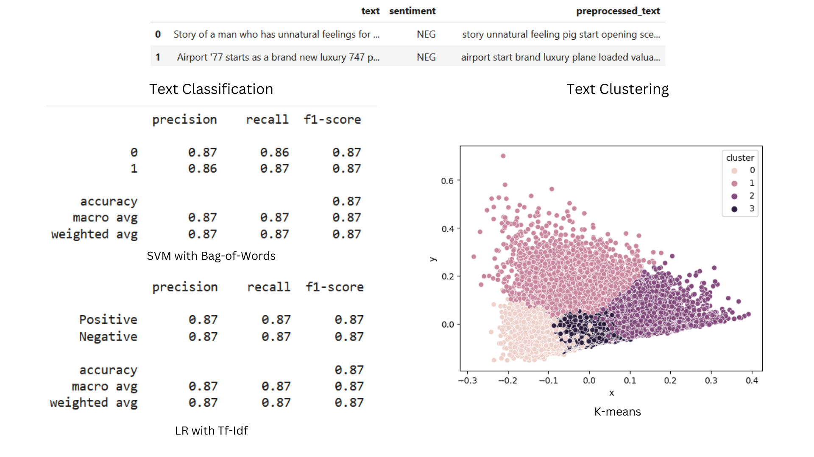</center>

---
### Data Science Lab on Smart Cities

[](https://github.com/fabriziocominetti/data-science-UniMiB/blob/main/Data%20Science%20Lab%20on%20Smart%20Cities/Report_DSLab-SmartCities.pdf)
[](https://github.com/fabriziocominetti/data-science-UniMiB/tree/main/Data%20Science%20Lab%20on%20Smart%20Cities)

**Mobility in Northern Sardinia** `|` [_Data Science Lab on Smart Cities_](https://elearning.unimib.it/course/info.php?id=44571), UniMiB (2023).

<p style="color:#727272">This project presents a comprehensive analysis of transportation dynamics in Northern Sardinia, focusing on airports, ports, public transit, and accessibility to key destinations. Several indicators are calculated, accompanied by data visualizations, to examine passenger flows, seasonal variations, and the impact of tourism on infrastructure, uncovering disparities in public transit coverage and accessibility, exacerbated by factors like depopulation and seasonal tourism. By studying arrival and departure patterns at major airports, alongside the distribution of bus stops and more, the study identifies areas for improvement in connectivity and mobility options.</p>


<center>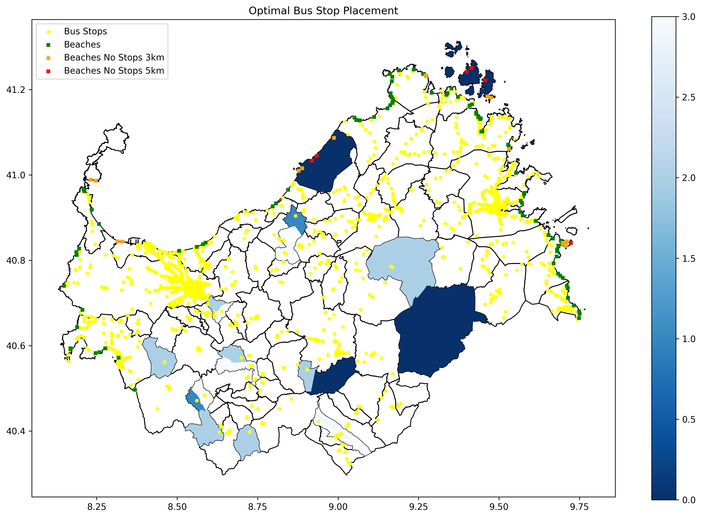</center>

---
## **Data World**
<!-- ```python
print("Explore Data Science Projects")
``` -->

Collection of various data science and data analytics projects (2021-now) `|` [GitHub](https://github.com/fabriziocominetti?tab=repositories)

<!--
<details>
  <summary>Table of Contents | Data</summary>

  - [FantaSanremo](#fantasanremo)
  - [Billboard Hot-100 EDA](#billboard-hot-100-eda)
  - [Serie A xG](#serie-a-xg)
  - [The Office](#the-office)
  - [Morbius](#morbius)

</details>
-->

---
### FantaSanremo

[](https://github.com/fabriziocominetti/fantasanremo)

**FantaSanremo 2023** - Trend and Sentiment Analysis

<p style="color:#727272">The 'Sanremo Festival' is becoming increasingly social. And so, companies and content creators also follow the events of the kermesse to stay up-to-date on any trends to be exploited and opportunities for growth. In recent years, 'FantaSanremo' - a game that involves viewers but also the singers in the competition - has become very popular among young and old enthusiasts. This project focuses on analyzing tweets related to the 2023 edition of #FantaSanremo, with the goal of analyzing content, the most relevant hashtags and sentiment related to the topic of interest.</p>

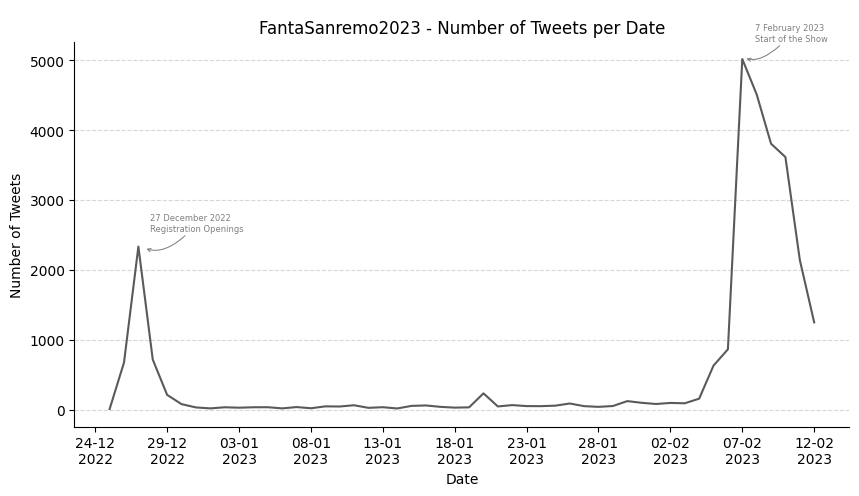

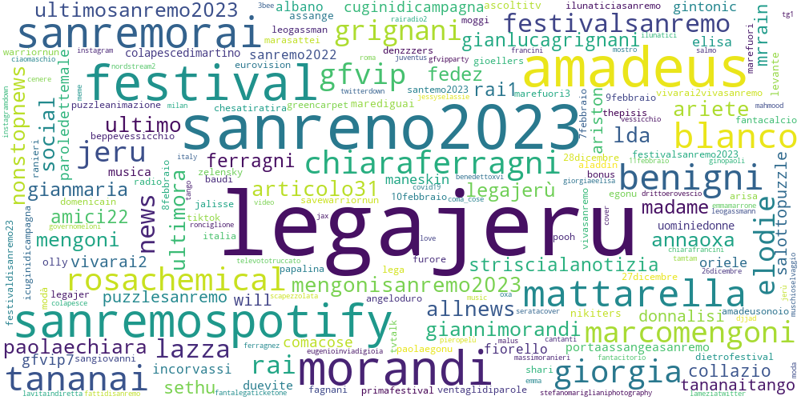

---
### The Office

[](https://github.com/fabriziocominetti/the-office)
[](https://kaggle.com/fabriziocominetti/the-office-lines)

**The Office GPT** - Web Scraping, Sentiment Analysis and NanoGPT

<p style="color:#727272">"The Office" is an American mockumentary sitcom television series that depicts the everyday work lives of office employees in the Scranton, Pennsylvania branch of the fictional Dunder Mifflin Paper Company. In this project, all the lines from all the seasons of the TV show were scraped using BeautifulSoup. Subsequently, an exploratory data analysis and sentiment analysis of all the scraped lines were performed. The sentiment analysis utilized VADER to calculate sentiment scores. Finally, PowerBI was employed for the final visualization of the analyzed data. Additionally, I leveraged the dataset I had created to experiment with the NanoGPT model, a small transformer-based language model introduced by Andrej Karpathy. In this scenario, I trained the model and experimented with it to generate various texts and ideas.</p>

<center>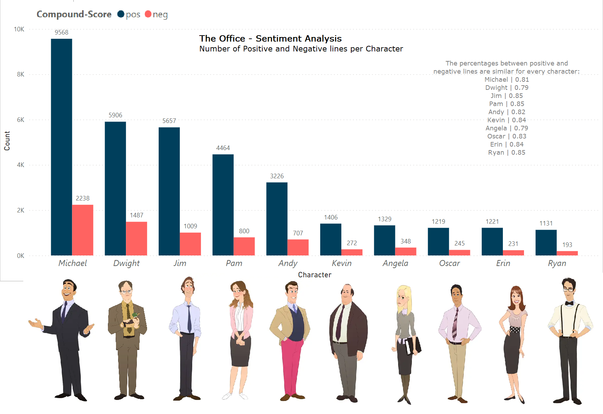</center>

<center>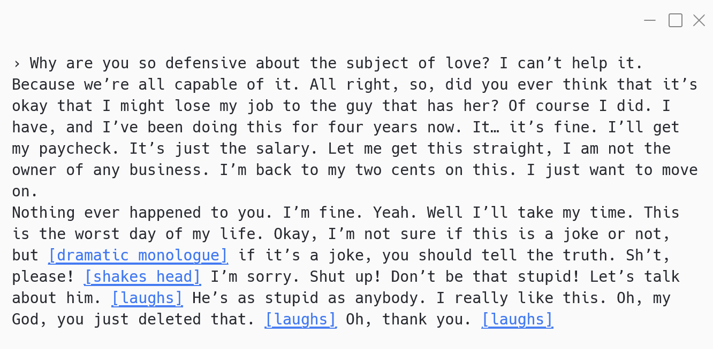</center>

---
### TV Ratings

[](https://github.com/fabriziocominetti/tv-ratings)

**IMDb Ratings** - Data Analysis

<p style="color:#727272">This project focuses on analyzing and visualizing IMDb ratings of popular TV series and films, aiming to uncover trends and patterns across seasons and episodes. The data visualization step employs two primary methods: trendline plotting, which provides insights on the show's performance over various seasons, and heatmap representations, providing a comprehensive overview of episode ratings across seasons.</p>

<center>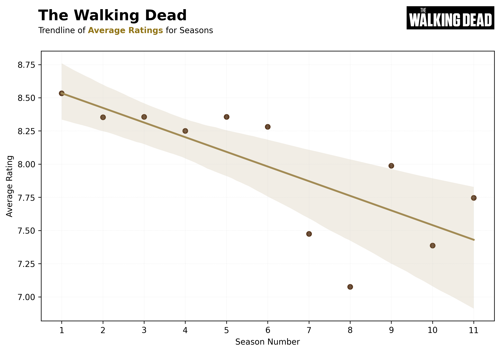</center>

<center>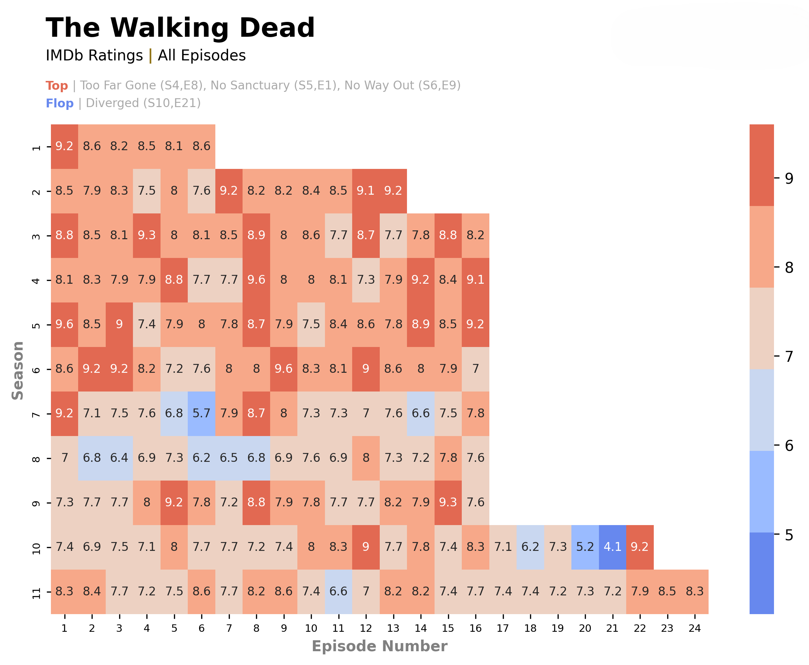</center>

---
### Billboard Hot-100 EDA

[](https://github.com/fabriziocominetti/billboard)

**Billboard's Hot-100 Weekly Charts** - Exploratory Data Analysis

<p style="color:#727272">The Billboard Hot 100 is the music industry standard record chart in the United States for songs, published weekly by Billboard magazine. I've conducted an exploratory data analysis of the Billboard dataset containing all the charts from 1958 to today using SQLite. Finally, I've visualized some of the results in a dashboard created with Tableau.</p>

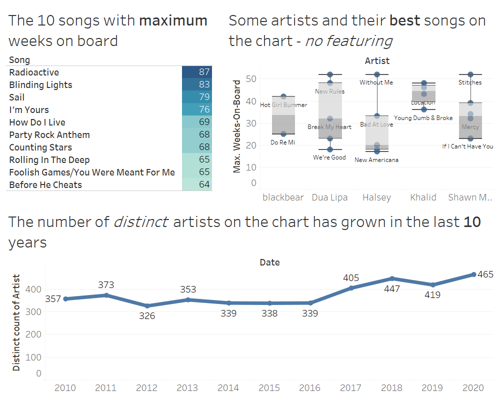

---
### Morbius

[](https://github.com/fabriziocominetti/morbius)

**Morbius & Moon Knight** - Sentiment Data Analysis

<p style="color:#727272">Morbius is a film from the Marvel catalogue. Tweets containing the keyword 'Morbius' were collected using the Twitter API and the Tweepy package to analyze the sentiment following the film's release. Sentiment analysis was conducted using VADER to calculate sentiment scores. The data was collected over the subsequent 4 days and then compared using a kdeplot. Additionally, data for the Moon Knight TV series, also from the Marvel Cinematic Universe, was collected for two days following the series' release. This data was then compared to the first two days after the release of Morbius.</p>

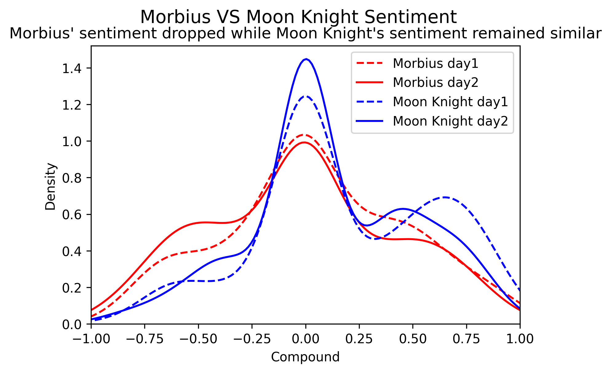

---
### Player Recommender Tool

<!-- [](https://huggingface.co/spaces/fcx1/Football-Player_Recommender-Tool) -->
[](https://github.com/fabriziocominetti/football-analytics/tree/main/player-recommender)

**Data-Driven Football Scouting Tool** - Streamlit Web App

<p style="color:#727272">This user-friendly tool utilizes football data to aid in football player scouting. Users can explore player data, compare players and identify potential substitutes and targets. The tool showcases key metrics for selected players and suggests similar players based on applied filters. Rankings are determined using a model that relies on cosine similarity, drawing data from FBRef covering the seasons of 2021/2022, 2022/2023, and 2023/2024 across the Top 5 football leagues. Player data is aggregated and calculated as the average performance over these three seasons, with metrics scaled based on 90-minute performances.</p>


---
### Serie A xG

[](https://github.com/fabriziocominetti/football-analytics/tree/main/xG-SerieA-2122)
[](projects/xG-serieA_2122.html)

**Serie A Expected Goals Performance** - Web Scraping and Exploratory Data Analysis

<p style="color:#727272">Web scraping of data from the FBref website was conducted to analyze the current state of the Serie A Italian football championship using requests and BeautifulSoup. At the time of the project, the break for national teams had left the league with 8-9 games remaining, with many situations yet to be determined. These final matches could significantly impact the outcome of the season, potentially transforming it from an extraordinary one to a lackluster performance, or vice versa, depending on whether teams achieve their goals. The dataset includes traditional football data along with xG, a metric used to assess expected goals for and against each team.</p>

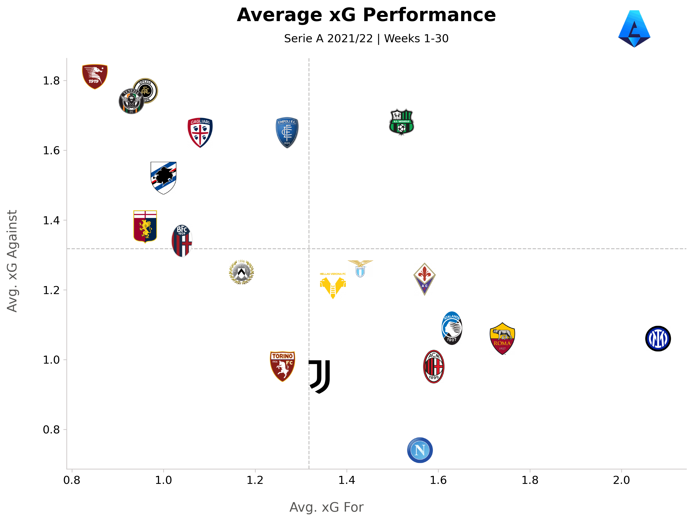

---
## **Football Analytics**
<!-- ```python
print("Explore Football Analytics Projects")
``` -->

Collection of various football analytics projects and visualizations (2021-now) `|` [GitHub](https://github.com/fabriziocominetti/football-analytics)

<center>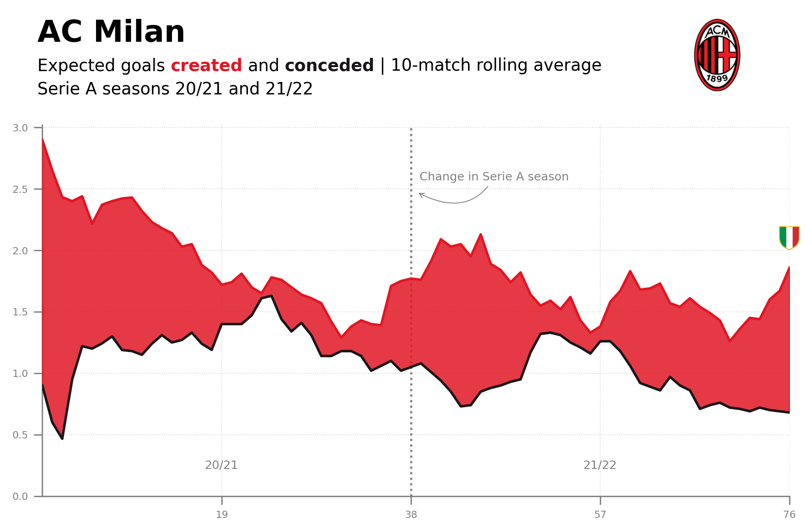</center>

**xG Rolling Plot** `|` [Code](https://github.com/fabriziocominetti/football-analytics/tree/main/xG-rolling-plot)

<!-- <p style="color:#727272">AC Milan won a second place in the 20-21 season and a first place in the 21-22 Serie A season. Under the leadership of Coach Pioli, the team has always expressed a quality football, dangerous in attack and with constant growth in defense. This visualization aims to compare xG created and conceded during these two seasons.</p>  -->

<center>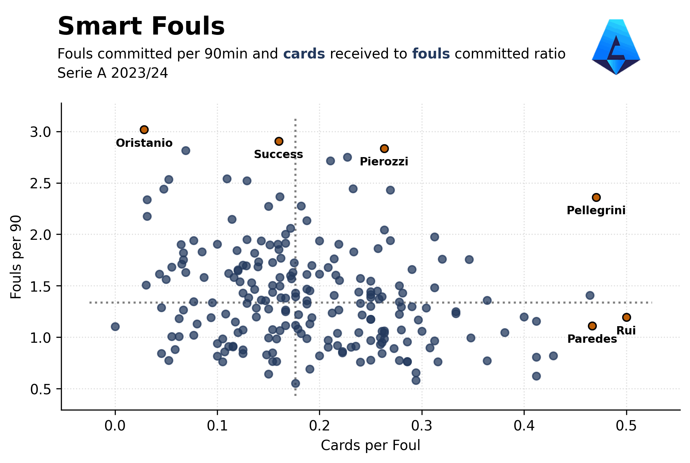</center>

**Smart Fouls** `|` [Code](https://github.com/fabriziocominetti/football-analytics/tree/main/smart-fouls)

<center>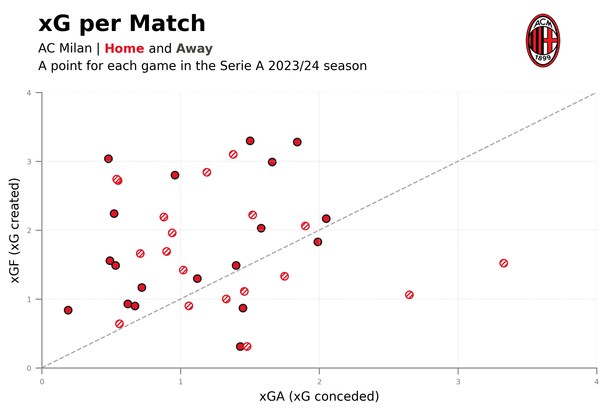</center>

**xG Scatter Plot** `|` [Code](https://github.com/fabriziocominetti/football-analytics/tree/main/xG-scatter)

<center>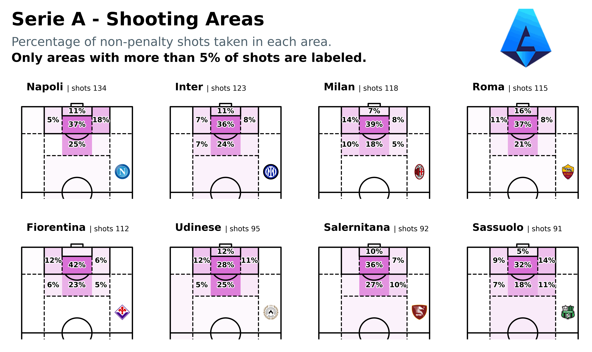</center>

**Tiled Shots Map** `|` [Code](https://github.com/fabriziocominetti/football-analytics/tree/main/tiled-shot-maps)

<center>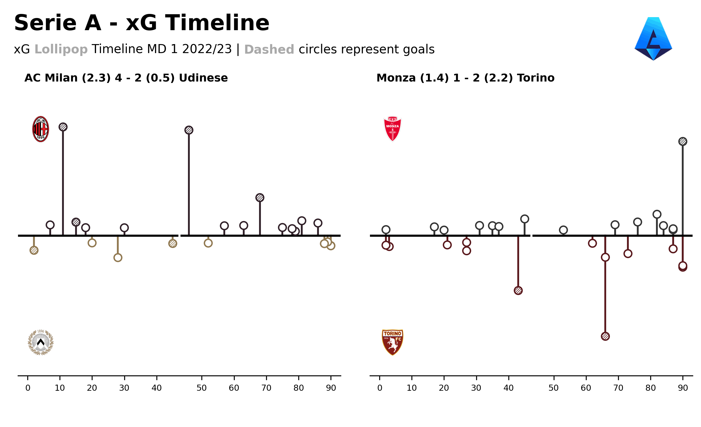</center>

**xG Lollipop** `|` [Code](https://github.com/fabriziocominetti/football-analytics/tree/main/xG-lollipop)

<center>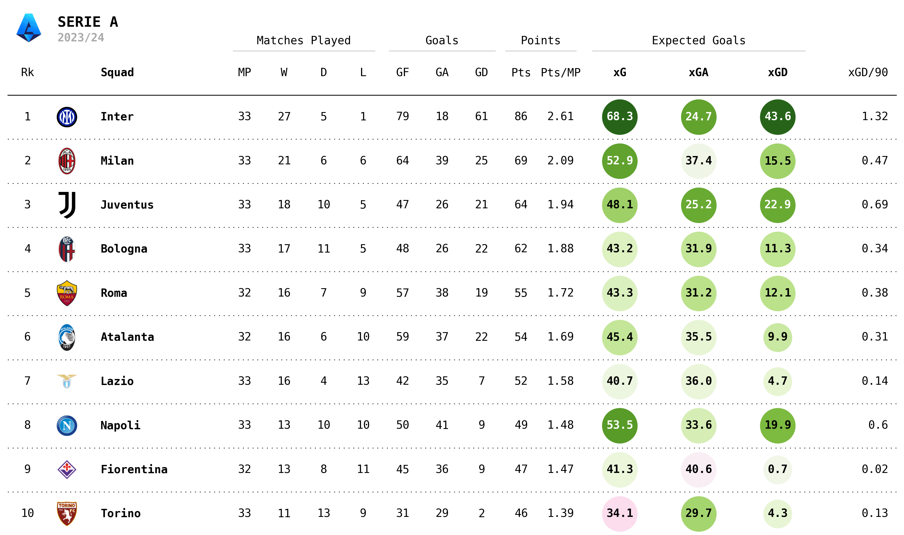</center>

**Plottable** `|` [Code](https://github.com/fabriziocominetti/football-analytics/tree/main/plottable)

---
<center>© Fabrizio Cominetti</center>
<!-- Powered by Jekyll and the Minimal Theme. -->