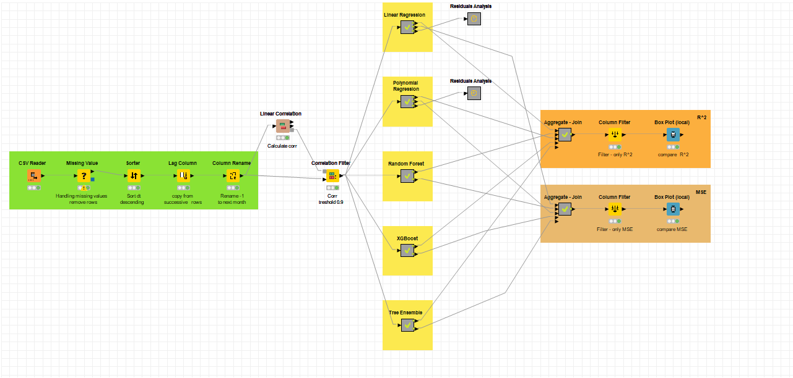
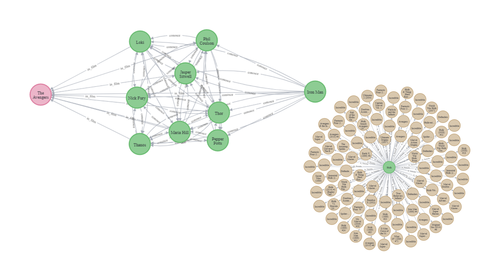
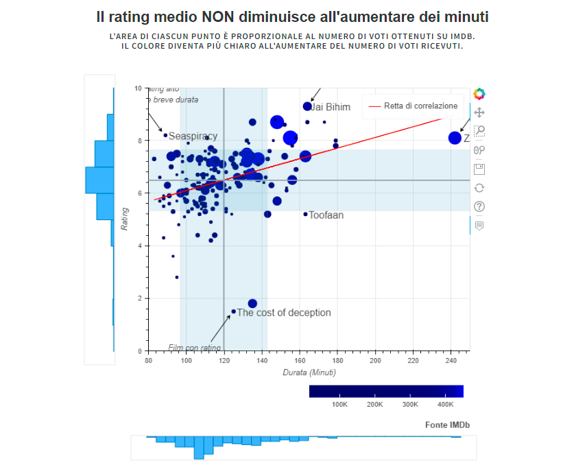
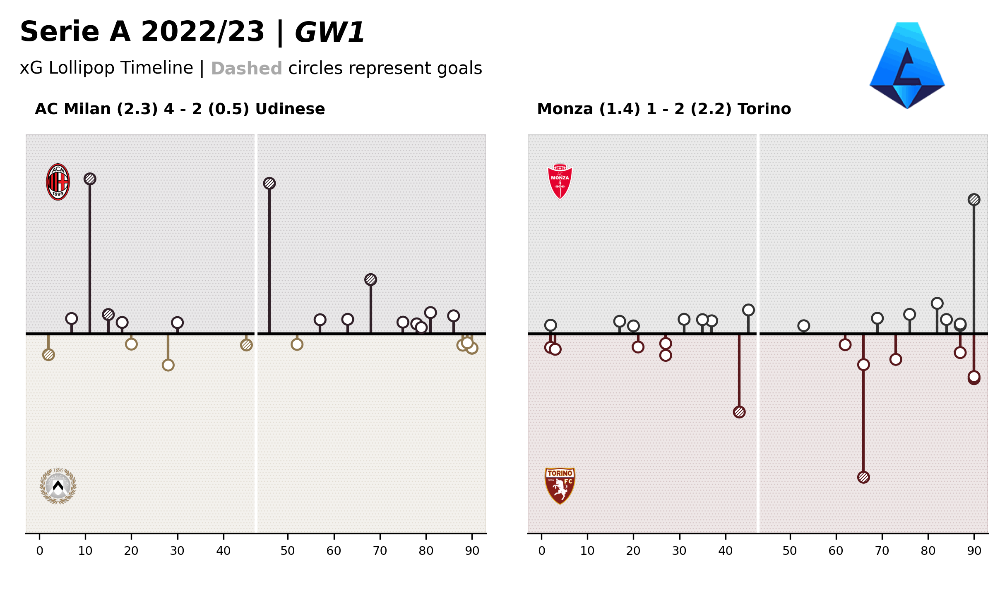
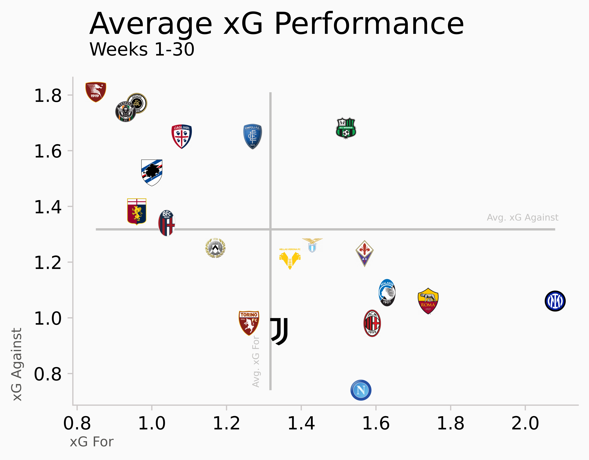
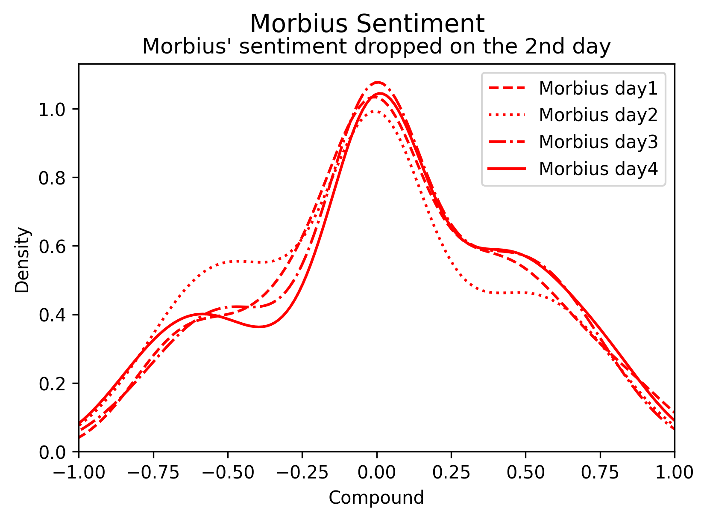

Hi Everyone! 👋 Welcome to <b><i>Fabrizio Cominetti</i></b>'s portfolio website

- 📌 I'm currently studying Data Science at **University of Milan-Bicocca**

# Portfolio
---

## Data Science UnimiB

Collection of projects realized for the university courses @ University of Milano-Bicocca (2021-now). Some of those accomplished as university projects will be illustrated below ([GitHub](https://github.com/fabriziocominetti/data-science-UNIMIB)).

---
### Machine Learning

My complete implementation of assignments and projects in [***Machine Learning and Decision Models***](https://elearning.unimib.it/course/info.php?id=37912) by Unimib (2022).

_**Climate Change - Temperature Prediction**_: machine learning classification project realized with `Knime`

The project consists in the analysis of various regression models applied to a dataset containing environmental information referred to the global temperature from January 1750 to November 2015.

---
### Data Management

My complete implementation of assignments and projects in [***Data Management***](https://elearning.unimib.it/course/info.php?id=37922) by Unimib (2022).

_**Marvel Graph Database**_: data management project realized with `Neo4j`

The project realized aims to create a graph-database containing the relationships between the various Marvel products. For the realization of this project we have chosen a non-relational graph-database, built through the use of Neo4j. We have realized this project starting from two data sources, API and web scraping, that we have then integrated and on which we have then performed a quality check. 
 
The final database is complete of the various relationships between characters, movies and comics of the Marvel world, moreover each node contains several information about its nature.

---
### Data Visualization

My complete implementation of assignments and projects in [***Data Visualization***](https://elearning.unimib.it/course/info.php?id=26218#en) by Unimib (2022).

_**Film - Rating and Duration Time**_: data visualization project realized with `Bokeh`

In today's attention economy and society is it true that people also prefer shorter films? This consideration guided us in the realization of this project and allowed us to determine the following research question: do shorter films generally receive better ratings? 
 
We have therefore used the datasets provided by IMDb to answer the research question through an interactive visualization.

## Football Analytics

Collection of projects related to the field of football analytics. ([GitHub](https://github.com/fabriziocominetti/football-analytics)).

---
### Expected Goals Lollipop

_**Serie A - xG Lollipop**_: football analytics project realized with `.py` and `matplotlib`

In this viz, I replicated a chart posted by Soccermatics that showcased the xG timeline of a match in the Swedish league and applied it to Serie A's first-round fixtures. Here's the lollipop xG chart, but for the first matches of the 1st round of the Serie A 22/23 season.

---
### Expected Goals Rolling Plot

_**xG Rolling Plot**_: football analytics project realized with `.py` and `matplotlib`

AC Milan won a second place in the 20-21 season and a first place in the 21-22 Serie A season. Under the leadership of Coach Pioli, the team has always expressed a quality football, dangerous in attack and with constant growth in defense. This visualization aims to compare xG created and conceded during these two seasons.

## Data Science

Various data science projects. ([GitHub](https://github.com/fabriziocominetti/))

---
### Billboard Hot-100 EDA

Exploratory data analysis of _**Billboard's Hot-100 Weekly Charts**_; realized with `SQLite` and `Tableau`

The Billboard Hot 100 is the music industry standard record chart in the United States for songs, published weekly by Billboard magazine. I've performed an exploratory data analysis of the Billboard dataset containing all the charts from 1958 to today. Finally, I've pictured some results obtained in a dashboard.

---
### Serie A xG EDA

Web scraping and exploratory data analysis of FBref's _**Serie A Expected Goals Standing**_; realized with `.py`

Web scraping of data from the FBref website to analyze the current state-of-doing of the Serie A Italian championship of football with requests and BeautifulSoup. At the time of the project, the break for the national teams leaves the league as is, with 8-9 games to play and with many situations to be determined. These last matches could make the difference between an extraordinary season and an undertone season, or a season where the team achieves its goals. 
 
The dataset contains info on classic football data with the addition of xG, a metric used to determine the expected goals, for and against, a team.

---
### The Office EDA

Web scraping of every lines from all seasons of the tv show _**The Office**_ followed by an exploratory data analysis and a sentiment analysis of the extracted data; realized with `BeautifulSoup`, `PowerBI` and `VADER`

The Office is an American mockumentary sitcom television series that depicts the everyday work lives of office employees in the Scranton, Pennsylvania branch of the fictional Dunder Mifflin Paper Company. In this project, I've firstly scraped all the lines of the TV show in a CSV file, then I've performed in two different jupyter notebooks an exploratory data analysis and a sentiment analysis of all the lines.

---
### Morbius Sentiment Analysis

_**Morbius**_ data collection from the Twitter API and sentiment analysis; project realized with `Tweepy` and `VADER`

Morbius is a film of the Marvel catalogue. I've collected tweets containing the keyword 'Morbius' with the Twitter API to analyze the sentiment that followed the release of the film. The data has been collected for the subsequent 4 days and then compared in a kdeplot. 
 
I've also collected data for the Moon Knight TV series, also from the Marvel Cinematic Universe. The data has been collected for two days after the release of the series and then compared to the first two days after the release of Morbius.

---
### Premier League Bar Chart Race

_**EPL - Bar Chart Race**_ of Premier League standings from 1992 to 2016, realized with `.ipynb` and `Tableau`

---

© 2022 Fabrizio Cominetti. Powered by Jekyll and the Minimal Theme.
