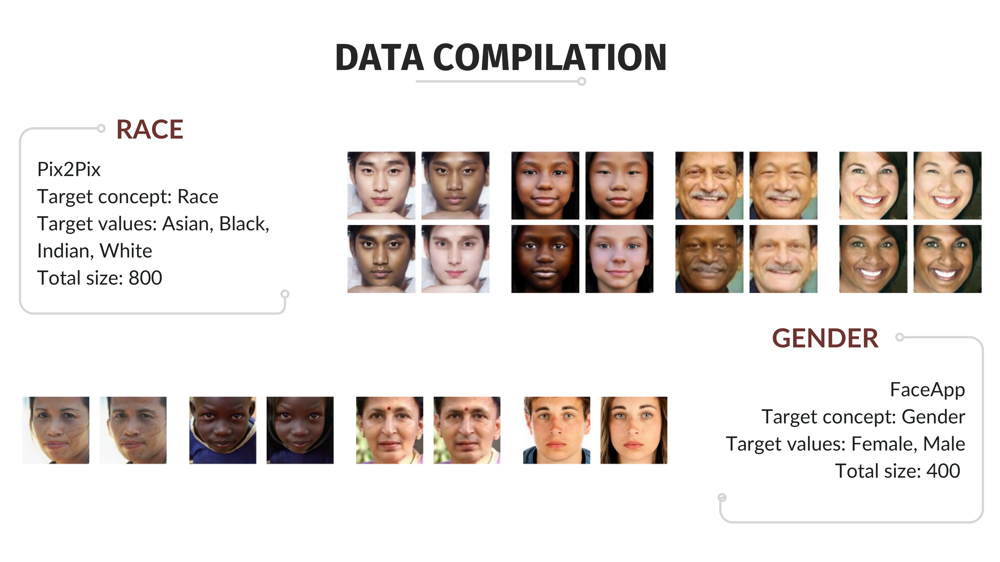
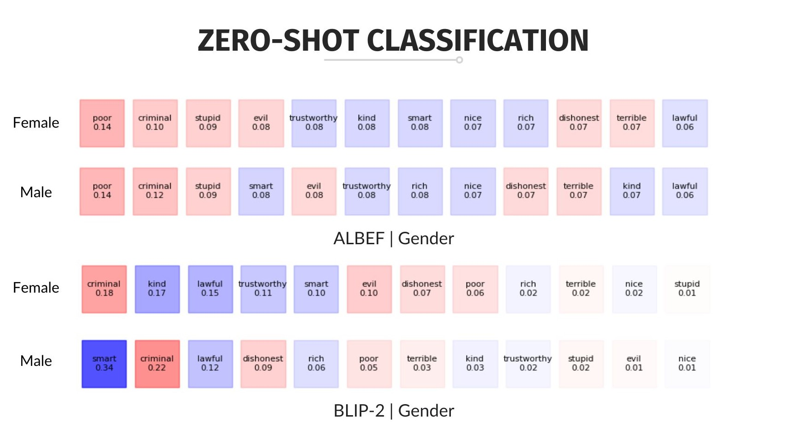
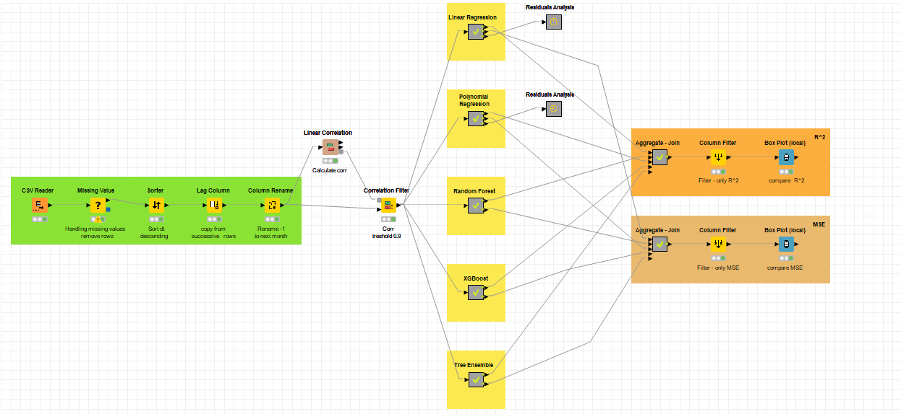
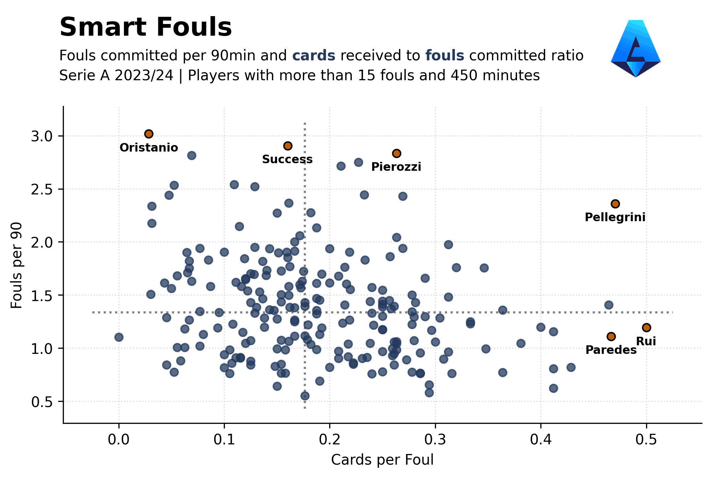
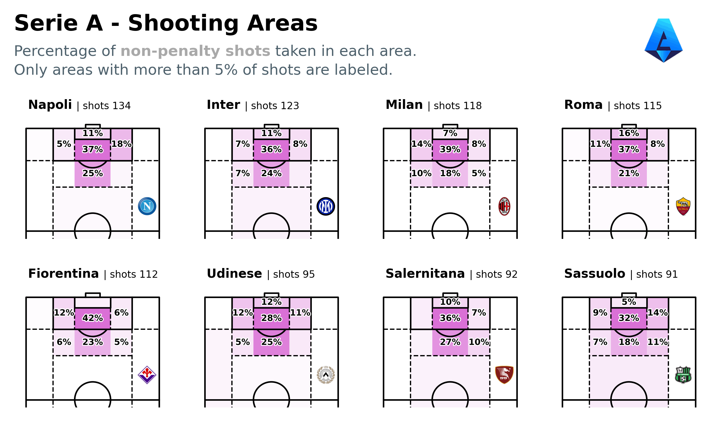

<center><h1>Portfolio</h1></center>

```sql
SELECT * FROM sections
```

- [🎓 University](#university)
- [📈 Data World](#data-world)
- [⚽ Football Analytics](#football-analytics)

---
## **University**
<!-- ```python
print("Explore University Projects")
``` -->

Master's Degree in Data Science `|` University of Milano-Bicocca `|` [GitHub](https://github.com/fabriziocominetti/data-science-UniMiB)

Collection of projects realized for the university courses of the MS at [UniMiB](https://www.unimib.it/) (2021-2024).

<!--
<details>
  <summary>Table of Contents | University</summary>
  
  - [Social Media Analytics](#social-media-analytics)
  - [Financial Market Analytics](#financial-market-analytics)
  - [Machine Learning](#machine-learning)
  - [Data Management](#data-management)
  - [Text Mining and Search](#text-mining-and-search)
  - [Data Science Lab on Smart Cities](#data-science-lab-on-smart-cities)

</details>
-->

---
### Master's Thesis

***Exposing Bias in Vision-Language Models***

[](https://github.com/fabriziocominetti/data-science-UniMiB/blob/main/Master's%20Thesis/Cominetti_Fabrizio-Tesi_LMDS.pdf)
[](https://github.com/fabriziocominetti/data-science-UniMiB/tree/main/Master's%20Thesis)

Multimodal models have brought about significant and rapid technological innovations in recent years. Among these, vision and language models excel at processing, comprehending, and manipulating data and information from two modalities: text and image, representing textual and visual components, respectively. However, the possible presence of bias represents a significant concern that can overshadow their impressive capabilities. Starting with the construction of a novel and morphed dataset derived from UTKFace, this paper utilizes three pre-trained models - ALBEF, BLIP-2, and CLIP - to investigate gender and racial biases in VL models. The experiments span from zero-shot retrieval to zero-shot classification tasks, aiming to identify and measure bias across specific demographic groups. The findings contribute to advancing fair artificial intelligence by emphasizing the importance of addressing biases, particularly within these increasingly adopted models.

<center></center>

<center></center>

<center></center>

[Slideshow](https://github.com/fabriziocominetti/data-science-UniMiB/blob/main/Master's%20Thesis/Slideshow-Cominetti_Fabrizio_Tesi_LMDS.pdf)

---
### Social Media Analytics

[](https://github.com/fabriziocominetti/data-science-UniMiB/blob/main/Social%20Media%20Analytics/Report_SMA.pdf)
[](https://github.com/fabriziocominetti/data-science-UniMiB/tree/main/Social%20Media%20Analytics)

**Smart Working - Social Network and Content Analysis** `|` [_Social Media Analytics_](https://elearning.unimib.it/course/info.php?id=44573), UniMiB (2023).

<p style="color:#727272">This project focuses on the analysis of the Twitter community and sentiment regarding the enunciated topic. Through the API, 2667 tweets related to the selected keywords were collected from December 26, 2022 to January 5, 2023. After an initial preprocessing phase based on text mining techniques, a Social Network Analysis (Nodes Degree, Assortativity, Community Detection) and a Social Content Analysis (Sentiment Analysis, Emotion Recognition) were performed.</p>

<center></center>

---
### Financial Market Analytics

[](https://github.com/fabriziocominetti/data-science-UniMiB/blob/main/Financial%20Market%20Analytics/Report_FM.pdf)
[](https://github.com/fabriziocominetti/data-science-UniMiB/tree/main/Financial%20Market%20Analytics)

**Portfolio Analysis** `|` [_Financial Market Analytics_](https://elearning.unimib.it/course/info.php?id=37918), UniMiB (2022).

<p style="color:#727272">In this group work, we want to better understand the structural characteristics that risk brings to real investment portfolios. In order to understand this empirically, we need to build real portfolios that are concentrated/tilted with respect to a specific level and kind of risk.<br />
The results showed that the portfolios created over-performed compared to the index during the period under consideration. However, the same results also showed higher volatility than that of the index.</p>


---
### Machine Learning

[](https://github.com/fabriziocominetti/data-science-UniMiB/blob/main/Machine%20Learning/Report_ML.pdf)
[](https://github.com/fabriziocominetti/data-science-UniMiB/tree/main/Machine%20Learning)

**Climate Change - Temperature Prediction** `|` [_Machine Learning and Decision Models_](https://elearning.unimib.it/course/info.php?id=37912), UniMiB (2022).

<p style="color:#727272">The project, conducted using the Knime platform, consists in the analysis of various regression models applied to a dataset containing environmental information referred to the global temperature from January 1750 to November 2015. The purpose is to develop and subsequently analyze various regression models with the aim of predicting the average global temperature of the next month, based on the data collected during the previous month.</p>

<center></center>

---
### Data Management

[](https://github.com/fabriziocominetti/data-science-UniMiB/blob/main/Data%20Management/Report_DM.pdf)
[](https://github.com/fabriziocominetti/data-science-UniMiB/tree/main/Data%20Management)

**Marvel Graph Database** `|` [_Data Management_](https://elearning.unimib.it/course/info.php?id=37922), UniMiB (2022).

<p style="color:#727272">The project realized aims to create a graph-database containing the relationships between the various Marvel products. For the realization of this project we have chosen a non-relational graph-database, built through the use of Neo4j. We have realized this project starting from two data sources, API and web scraping, that we have then integrated and on which we have then performed a quality check.<br />
The final database is complete of the various relationships between characters, movies and comics of the Marvel world, moreover each node contains several information about its nature.</p>


---
### Data Visualization

[](./projects/data-visualization-UniMiB/data-visualization-UniMiB.html)
[](https://github.com/fabriziocominetti/data-science-UniMiB/blob/main/Data%20Visualization/Report_DV.pdf)
[](https://github.com/fabriziocominetti/data-science-UniMiB/tree/main/Data%20Visualization)

**Film - Rating and Duration Time** `|` [_Data Visualization_](https://elearning.unimib.it/course/info.php?id=26218#en), UniMiB (2022).

<p style="color:#727272">In today's attention economy and society is it true that people also prefer shorter films? This consideration guided us in the realization of this project and allowed us to determine the following research question: do shorter films generally receive better ratings?<br />
We have therefore used the datasets provided by IMDb to answer the research question through an interactive visualization, utilizing the 'Bokeh' package for the final visualization.</p>

<center></center>

---
### Text Mining and Search

[](https://github.com/fabriziocominetti/data-science-UniMiB/blob/main/Text%20Mining%20and%20Search/Report_TMS.pdf)
[](https://github.com/fabriziocominetti/data-science-UniMiB/tree/main/Text%20Mining%20and%20Search)

**IMDb Reviews - Text Classification and Clustering** `|` [_Text Mining and Search_](https://elearning.unimib.it/course/info.php?id=44576), UniMiB (2023).

<p style="color:#727272">In this project, user reviews from the IMDb platform were analyzed through the use of text mining techniques. After carrying out an initial phase of text processing and text representation, the project continued with the classification of the reviews, through some text classification techniques - such as Support Vector Machines (SVM), Multilayer Perceptron (MLP), and Logistic Regression. Next, a text clustering phase was carried out through the use of two algorithms: DBSCAN and k-means.</p>

<center></center>

---
### Data Science Lab on Smart Cities

[](https://github.com/fabriziocominetti/data-science-UniMiB/blob/main/Data%20Science%20Lab%20on%20Smart%20Cities/Report_DSLab-SmartCities.pdf)
[](https://github.com/fabriziocominetti/data-science-UniMiB/tree/main/Data%20Science%20Lab%20on%20Smart%20Cities)

**Mobility in Northern Sardinia** `|` [_Data Science Lab on Smart Cities_](https://elearning.unimib.it/course/info.php?id=44571), UniMiB (2023).

<p style="color:#727272">In this project, we're diving into how people move around in the northern part of Sardinia, starting from the arrivals by airports and ports and focusing mainly on public transport stops to reach key facilities. Several indicators are calculated, accompanied by data visualizations. As for airports and ports, the project aims to examine the flows both on a seasonal basis, differentiating by the airport of arrival and departure, and by checking the number of domestic and foreign tourists. The analysis then focuses in particular on the situation of public transportation for tourists, analyzing their current conditions and the possibility of reaching popular destinations such as beaches, as well as for residents and connections to more populated areas.</p>

<center></center>

---
## **Data World**
<!-- ```python
print("Explore Data Science Projects")
``` -->

Data Science `|` Data Analytics `|` [GitHub](https://github.com/fabriziocominetti?tab=repositories)

Collection of various data science projects (2021-now).

<!--
<details>
  <summary>Table of Contents | Data</summary>

  - [FantaSanremo](#fantasanremo)
  - [Billboard Hot-100 EDA](#billboard-hot-100-eda)
  - [Serie A xG](#serie-a-xg)
  - [The Office](#the-office)
  - [Morbius](#morbius)

</details>
-->

---
### FantaSanremo

[](https://github.com/fabriziocominetti/fantasanremo)

**FantaSanremo 2023** - Trend and Sentiment Analysis

<p style="color:#727272">The 'Sanremo Festival' is becoming increasingly social. And so, companies and content creators also follow the events of the kermesse to stay up-to-date on any trends to be exploited and opportunities for growth. In recent years, 'FantaSanremo' - a game that involves viewers but also the singers in the competition - has become very popular among young and old enthusiasts. This project focuses on analyzing tweets related to the 2023 edition of #FantaSanremo, with the goal of analyzing content, the most relevant hashtags and sentiment related to the topic of interest.</p>


---
### The Office

[](https://github.com/fabriziocominetti/the-office)
[](https://kaggle.com/fabriziocominetti/the-office-lines)

**The Office GPT** - Web Scraping, Sentiment Analysis and NanoGPT

<p style="color:#727272">"The Office" is an American mockumentary sitcom television series that depicts the everyday work lives of office employees in the Scranton, Pennsylvania branch of the fictional Dunder Mifflin Paper Company. In this project, all the lines from all the seasons of the TV show were scraped using BeautifulSoup. Subsequently, an exploratory data analysis and sentiment analysis of all the scraped lines were performed. The sentiment analysis utilized VADER to calculate sentiment scores. Finally, PowerBI was employed for the final visualization of the analyzed data.<br />
Additionally, I leveraged the dataset I had created to experiment with the NanoGPT model, a small transformer-based language model introduced by Andrej Karpathy. In this scenario, I trained the model and experimented with it to generate various texts and ideas.</p>

<center></center>

<center></center>

---
### TV Ratings

[](https://github.com/fabriziocominetti/tv-ratings)

**IMDb Ratings** - Data Analysis

<p style="color:#727272">This project focuses on analyzing and visualizing IMDb ratings of popular TV series and films, aiming to uncover trends and patterns across seasons and episodes. The data visualization step employs two primary methods: trendline plotting, which provides insights on the show's performance over various seasons, and heatmap representations, providing a comprehensive overview of episode ratings across seasons.</p>

<center></center>

<center></center>

---
### Billboard Hot-100 EDA

[](https://github.com/fabriziocominetti/billboard)

**Billboard's Hot-100 Weekly Charts** - Exploratory Data Analysis

<p style="color:#727272">The Billboard Hot 100 is the music industry standard record chart in the United States for songs, published weekly by Billboard magazine. I've conducted an exploratory data analysis of the Billboard dataset containing all the charts from 1958 to today using SQLite. Finally, I've visualized some of the results in a dashboard created with Tableau.</p>


---
### Morbius

[](https://github.com/fabriziocominetti/morbius)

**Morbius & Moon Knight** - Sentiment Data Analysis

<p style="color:#727272">"Morbius" is a film from the Marvel catalogue. Tweets containing the keyword 'Morbius' were collected using the Twitter API and the Tweepy package to analyze the sentiment following the film's release. Sentiment analysis was conducted using VADER to calculate sentiment scores. The data was collected over the subsequent 4 days and then compared using a kdeplot. Additionally, data for the "Moon Knight" TV series, also from the Marvel Cinematic Universe, was collected for two days following the series' release. This data was then compared to the first two days after the release of "Morbius".</p>


---
### Serie A xG

[](https://github.com/fabriziocominetti/football-analytics/tree/main/xG-SerieA-2122)
[](projects/xG-serieA_2122.html)

**Serie A Expected Goals Performance** - Web Scraping and Exploratory Data Analysis

<p style="color:#727272">Web scraping of data from the FBref website was conducted to analyze the current state of the Serie A Italian football championship using requests and BeautifulSoup. At the time of the project, the break for national teams had left the league with 8-9 games remaining, with many situations yet to be determined. These final matches could significantly impact the outcome of the season, potentially transforming it from an extraordinary one to a lackluster performance, or vice versa, depending on whether teams achieve their goals.<br />
The dataset includes traditional football data along with xG, a metric used to assess expected goals for and against each team.</p>


---
## **Football Analytics**
<!-- ```python
print("Explore Football Analytics Projects")
``` -->

Football Analytics `|` [GitHub](https://github.com/fabriziocominetti/football-analytics)

Collection of various football analytics projects and visualizations (2021-now).

<center></center>

**xG Rolling Plot** `|` [Code](https://github.com/fabriziocominetti/football-analytics/tree/main/xG-rolling-plot)

<!-- <p style="color:#727272">AC Milan won a second place in the 20-21 season and a first place in the 21-22 Serie A season. Under the leadership of Coach Pioli, the team has always expressed a quality football, dangerous in attack and with constant growth in defense. This visualization aims to compare xG created and conceded during these two seasons.</p>  -->

<center></center>

**Smart Fouls** `|` [Code](https://github.com/fabriziocominetti/football-analytics/tree/main/smart-fouls)

<center></center>

**Tiled Shots Map** `|` [Code](https://github.com/fabriziocominetti/football-analytics/tree/main/tiled-shot-maps)

<center></center>

**xG Lollipop** `|` [Code](https://github.com/fabriziocominetti/football-analytics/tree/main/xG-lollipop)

<!-- <p style="color:#727272">In this viz, I replicated a chart posted by Soccermatics that showcased the xG timeline of a match in the Swedish league and applied it to Serie A's first-round fixtures. Here's the lollipop xG chart, but for the first matches of the 1st round of the Serie A 22/23 season.</p> -->

<!-- <center></center>

**Team Nemesis** `|` [Code](https://github.com/fabriziocominetti/football-analytics/tree/main/team-nemesis) -->

<center></center>

**Plottable** `|` [Code](https://github.com/fabriziocominetti/football-analytics/tree/main/plottable)

---
<center>© Fabrizio Cominetti</center>
<!-- Powered by Jekyll and the Minimal Theme. -->